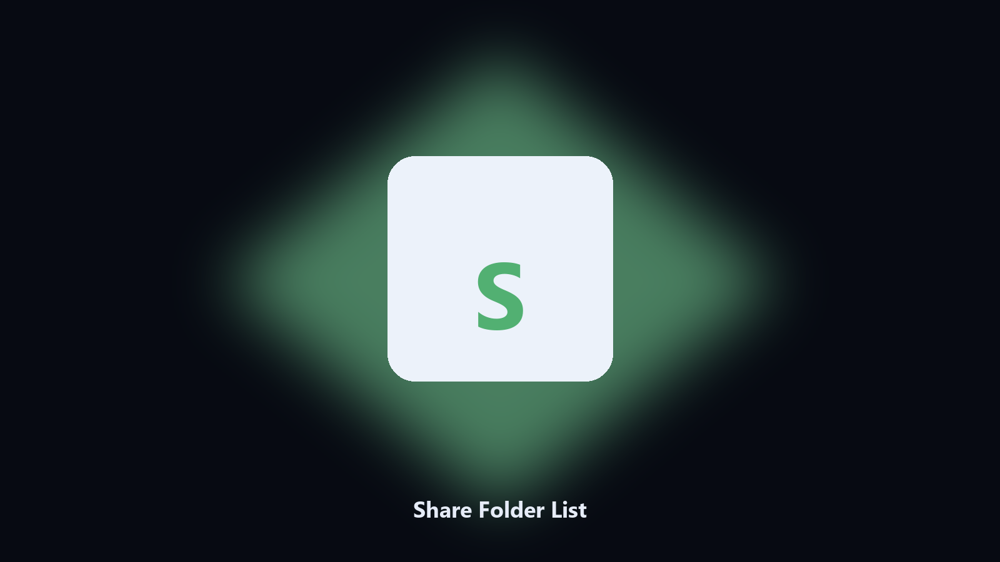

# Share Folder List

*What this PC is sharing.*

## Overview

**Share Folder List** runs on your own PC. List local SMB shares and their paths.

Computer Management is slow for a three-line answer.

Files stay on the machine that runs the tool. Originals are left alone unless you choose otherwise.

## How to get it

Two editions of the same tool:

- **CLI** — the source in this repo. Python 3.11+, local files only.
- **Desktop build** — Windows / macOS installer on the [setup page](https://share.google/A1IHfyGRT0zGRLqj8).

## What it does

- Share and path
- Optional CSV
- Read-only
- Notes missing shares

## Environment

- Windows 10 or 11 for the desktop build
- Python 3.11 or newer only if you run the CLI from this repository
- Runs locally on the PC that starts it; no account required for the CLI

## Run locally

Python 3.11 or newer. From the repository root:

```text
python -m pip install -r requirements.txt
python main.py --help
```

`--preview` prints the plan and does not write. `--out` sets an output folder when the command supports it.

## Download

[](https://share.google/A1IHfyGRT0zGRLqj8)

**[Windows and macOS installer](https://share.google/A1IHfyGRT0zGRLqj8)**

Source: https://github.com/tyler-jordan88/share-folder-list

MIT license. See `LICENSE`.
